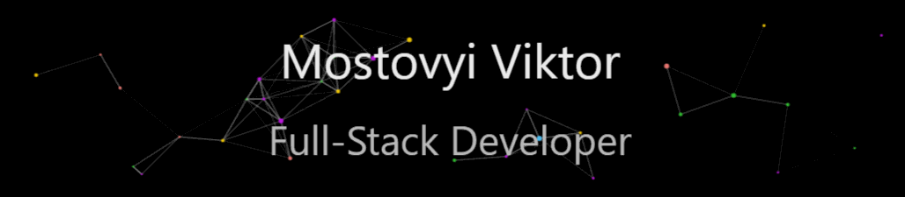

<!--  -->

<!-- <h2>Hi there 👋, I'm Viktor!</h2> -->

<!-- 

YOU CAN CONTACT ME

  <ul>
    <li></li>
     <li></li>
     <li></li>
  </ul>
  
 -->

<h2>Languages</h2>

 
 
 
 
 

 
 
 

<h2>Software and Tools</h2>

  

      
      
      
      
      
      
      
      
      
      
      
      
      
      
      
      
      
      
  

 

<a href="#"><!-- wi*quL3fcV --></a>

<!-- 

<h3> 📊 GitHub Stats</h3>

 
 

 -->

 

<h2>Support my work</h2>

 

 
 
 

<!---->
